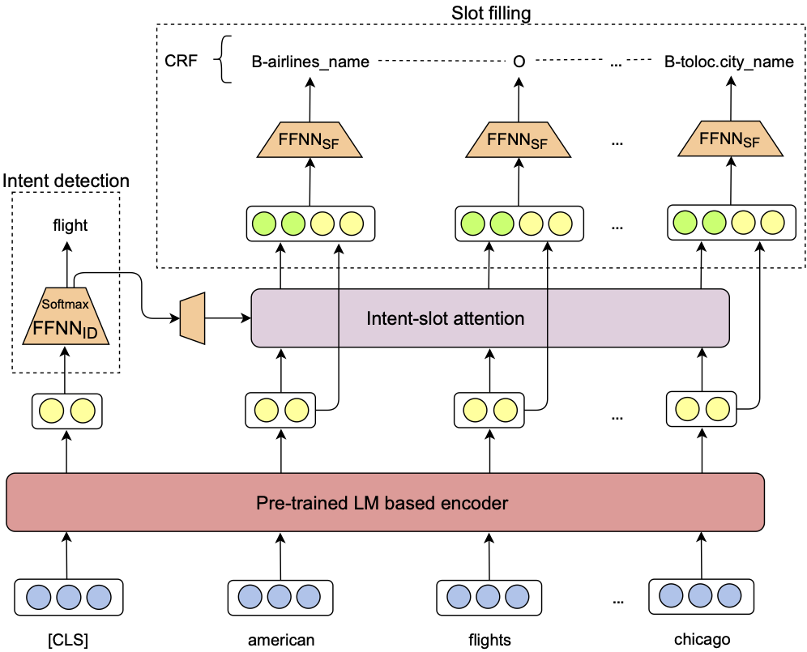
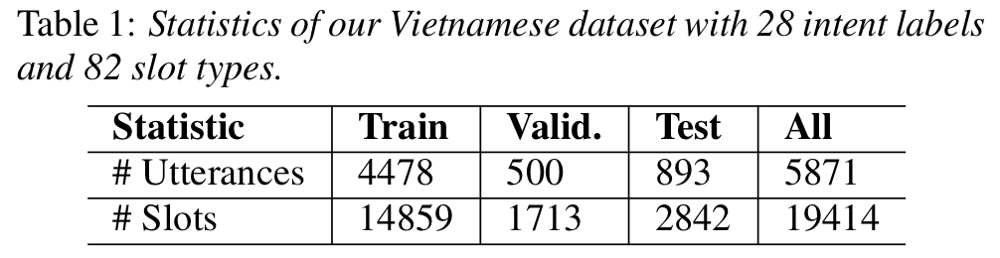

# VLP_NLU: An Improvement of Joint Intent Detection and Slot Filling for Vietnamese

This project implements a joint model, **JointIDSF**, for intent detection and slot filling, extending the recent state-of-the-art [JointBERT+CRF](https://arxiv.org/abs/1902.10909) model. JointIDSF integrates an intent-slot attention layer to explicitly incorporate intent context information into slot filling via "soft" intent label embedding.

**Project highlights**:
- Development of JointIDSF, a model specifically optimized for Vietnamese natural language understanding (NLU).
- Introduction of a public dataset for intent detection and slot filling tailored to the Vietnamese language.
- Experimental results on this Vietnamese dataset demonstrate that JointIDSF significantly outperforms the JointBERT+CRF baseline.

<p align="center">	

</p>

Further details on JointIDSF’s architecture, dataset construction, and experimental results can be found in our [paper](https://www.isca-speech.org/archive/interspeech_2021/dao21_interspeech.html):

```bibtex
@inproceedings{JointIDSF,
    title     = {{Intent Detection and Slot Filling for Vietnamese}},
    author    = {Mai Hoang Dao and Thinh Hung Truong and Dat Quoc Nguyen},
    booktitle = {Proceedings of the 22nd Annual Conference of the International Speech Communication Association (INTERSPEECH)},
    year      = {2021}
}
```

**Please CITE** this paper if you use this dataset or model implementation in your own research or software.

## Dataset

<p align="center">	

</p>

> **By downloading [their dataset](https://github.com/tue09/VLP_NLU/tree/main/PhoATIS), the USER agrees:**
> - To use the dataset solely for research or educational purposes.
> - **Not** to redistribute the dataset, in whole or in part, in any form.
> - To cite our paper whenever the dataset is used in research publications.

## Model Installation, Training, and Evaluation

### Installation

Requirements:
- Python >= 3.6
- PyTorch >= 1.4.0

Clone and install:
```bash
git clone https://github.com/tue09/VLP_NLU.git
cd VLP_NLU/
pip install -r requirements.txt
```

### Training and Evaluation

Use the following bash scripts to reproduce results from our paper:
```bash
./run_jointIDSF_PhoBERTencoder.sh
./run_jointIDSF_XLM-Rencoder.sh
```

- These scripts cover training for both JointIDSF and the baseline JointBERT+CRF.  
- The `run_jointIDSF_XLM-Rencoder.sh` script can be adapted for other languages with annotated datasets for intent detection and slot filling. Prepare your data in the format found in the `data` directory.

### Inference

We provide model checkpoints for both JointBERT+CRF and JointIDSF. You can download these to perform inference on new text data without retraining the models from scratch:
- **JointIDSF**
  - [PhoBERTencoder](http://public.vinai.io/JointIDSF_PhoBERTencoder.tar.gz)
  - [XLM-Rencoder](http://public.vinai.io/JointIDSF_XLM-Rencoder.tar.gz)
- **JointBERT+CRF**
  - [PhoBERTencoder](http://public.vinai.io/JointBERT-CRF_PhoBERTencoder.tar.gz)
  - [XLM-Rencoder](http://public.vinai.io/JointBERT-CRF_XLM-Rencoder.tar.gz)

To tag a new text file using the JointIDSF model:
```bash
python3 predict.py --input_file <path_to_input_file> \
                   --output_file <output_file_name> \
                   --model_dir JointIDSF_XLM-Rencoder
```
The input file should be a plain text file, with one utterance per line.

### Acknowledgments

Our code builds upon the unofficial implementation of [JointIDFS](https://github.com/VinAIResearch/JointIDSF).
